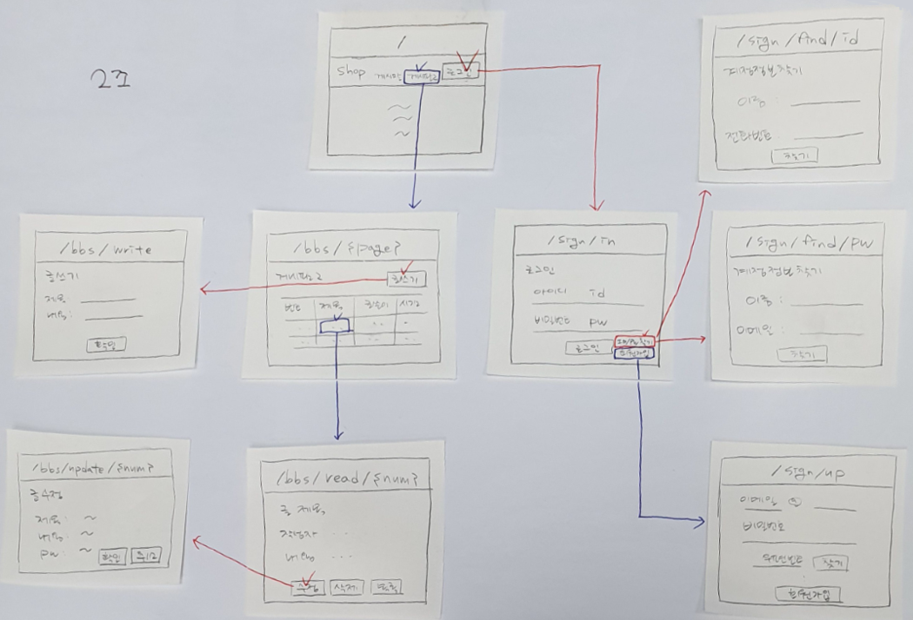
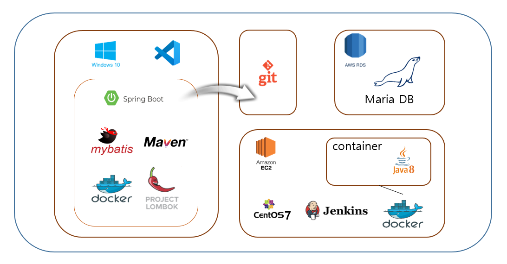
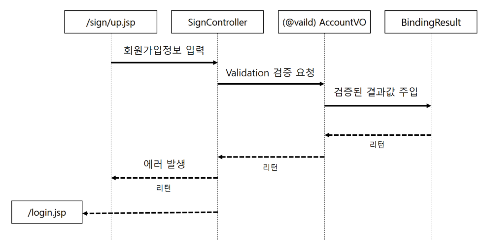
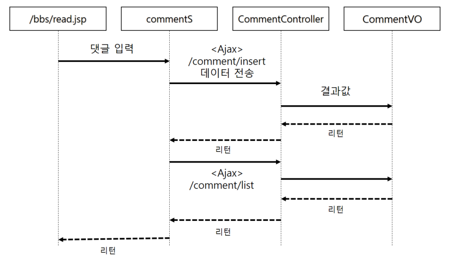
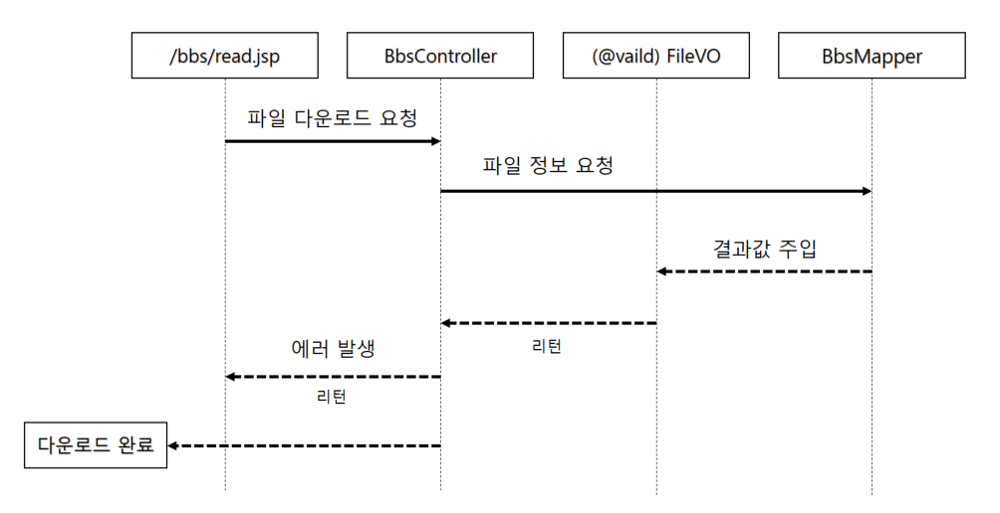

<<<<<<< HEAD
#SPRING PROJECT-

## 1. PAGE구조

## 2. architecture

## 3. SPRING BOOT 장점

- 수작업으로 초기 셋업하는 과정 없이 간단히 프로젝트를 띄울 수 있음
  (수작업으로 셋업하더라고 이전에 비해 반 이상 단순해짐)
- Spring framework 보다 간단해진 설정(자동환경설정)
- 기본 설정된 옵션
- 내장 된 WAS
  Tomcat 서버를 내장하고 있어 웹 프로젝트를 띄우는 시간이 독립적인 Tomcat 보다 반은 단축 됨
- 간단한 배포와 실행

## 4. 기술

#### validation

#### comment

#### file download

## 5. 시연

#### http://daedrip.pc.to/
=======
#SPRING PROJECT

## 1. PAGE구조

## 2. architecture

## 3. SPRING BOOT 장점

- 수작업으로 초기 셋업하는 과정 없이 간단히 프로젝트를 띄울 수 있음
  (수작업으로 셋업하더라고 이전에 비해 반 이상 단순해짐)
- Spring framework 보다 간단해진 설정(자동환경설정)
- 기본 설정된 옵션
- 내장 된 WAS
  Tomcat 서버를 내장하고 있어 웹 프로젝트를 띄우는 시간이 독립적인 Tomcat 보다 반은 단축 됨
- 간단한 배포와 실행

## 4. 기술

#### validation

#### comment

#### file download

## 5. 시연

#### http://daedrip.pc.to/
>>>>>>> origin/master
